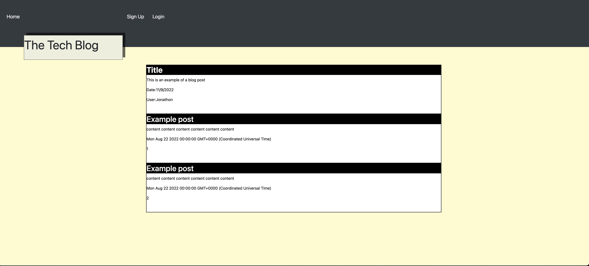

# # Title: MVC-Blog

## Discription:
* MVC-Blog allows a user to create an account, once logged in the User can add to a post of blogs to share to other users. The user is presented with a login and sign up page.
Once the user creates an account, the user can login to his/her account and create and add a blog post!

## Table of Contents (optional)
- [Installation](#installation)
- [Usage](#usage)
- [Credits](#credits)
- [License](#license)

## Installation:
- What are the steps to install your project?
* no installation needed 

## Usage:
Add a screenshot, create an `assets/images` folder in your repository and upload your screenshot to it. Then, using the relative filepath, add it to your README using the following syntax: !'[alt text](assets/images/screenshot.png)'
screenshot: 

## Credits:
* Collaborators: n/a
* Assets: n/a
* Tutorials: youtube.com
* Features: n/a
## Links:
* Github link: https://github.com/jonathonvanausdal9915
* heroku link: https://mvc-tech-app.herokuapp.com
